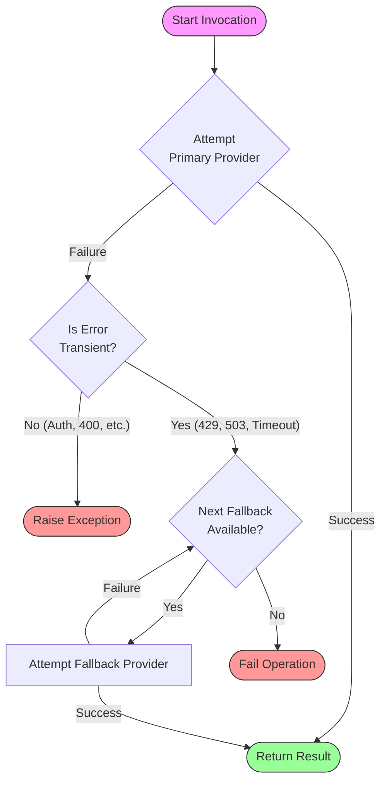

# Fallback Models Feature Documentation

## 1. Executive Summary

The **Fallback Models** feature enhances the operational resilience of `bmad-assist` by implementing an automated failover mechanism for Large Language Model (LLM) providers. When a primary provider encounters a transient failure (such as rate limiting, service timeouts, or temporary outages), the system automatically and seamlessly switches to pre-configured alternative providers. This ensures the continuity of critical, long-running workflows without user intervention.

## 2. Architecture & Logic Flow

The fallback mechanism operates on a simple but robust failover chain. Non-transient errors on the **primary** provider (like authentication failures or invalid requests) immediately halt execution. For **fallback** providers, all errors (transient or not) trigger the next fallback in the chain, maximizing resilience.

### Logic Schema



### Stateless Retry Behavior

The `FallbackProvider` is **stateless**: it does not remember past failures across invocations. Each call to `invoke()` starts fresh by attempting the primary provider first. This is intentional because transient errors (rate limits, timeouts) are temporary—the primary provider may have recovered by the time the next phase or prompt begins.

**Consequence for multi-phase loops:** If the primary provider fails during Phase A and a fallback is used, Phase B will still attempt the primary provider again. If it's still rate-limited, the fallback chain activates again automatically.

## 3. Configuration Reference

To enable fallbacks, define a `fallbacks` list within your provider configuration in `bmad-assist.yaml`. This feature is available for all three provider scopes: `master`, `multi`, and `helper`.

### 3.1 Configuration Fields

Each fallback entry supports the same fields as its parent provider type:

| Field              | Required | Description                                                             | Scopes            |
| :----------------- | :------: | :---------------------------------------------------------------------- | :---------------- |
| `provider`         |    ✅    | Provider name (e.g., `claude`, `gemini`, `openai`, `kimi`)              | All               |
| `model`            |    ✅    | Model identifier for CLI invocation (e.g., `opus`, `sonnet`, `gpt-4o`)  | All               |
| `model_name`       |    ❌    | Display name for logs/reports (overrides `model` in output)             | All               |
| `settings`         |    ❌    | Path to provider settings JSON file (tilde `~` expanded)                | All               |
| `thinking`         |    ❌    | Enable thinking mode for supported providers (e.g., `kimi`)             | `multi` only      |
| `reasoning_effort` |    ❌    | Reasoning effort for codex: `minimal`, `low`, `medium`, `high`, `xhigh` | `master`, `multi` |
| `fallbacks`        |    ❌    | Nested fallback chain (recursive)                                       | All               |

### 3.2 Master Provider (Single-LLM Phases)

For phases using a single LLM (e.g., `create_story`, `dev_story`, `code_review_synthesis`), configure the master provider chain:

```yaml
providers:
  master:
    # Primary Provider: The preferred high-performance model
    provider: claude
    model: opus

    # Fallback Chain: Tried sequentially upon transient failure
    fallbacks:
      # Tier 1 Fallback: A strong alternative
      - provider: gemini
        model: gemini-1.5-pro

      # Tier 2 Fallback: A highly available budget backup
      - provider: deepseek
        model: deepseek-chat
```

### 3.3 Multi Provider (Parallel Phases)

For parallel execution phases like `validate_story` or `code_review`, each reviewer can possess an independent fallback chain. This isolation prevents one provider's outage from stalling the entire parallel operation.

```yaml
providers:
  multi:
    # Reviewer A: Independent Chain (Claude -> Gemini)
    - provider: claude
      model: sonnet
      model_name: glm-4.7
      settings: ~/.claude/glm.json
      fallbacks:
        - provider: gemini
          model: gemini-1.5-pro

    # Reviewer B: Independent Chain (GPT-4o -> GPT-4o-mini)
    - provider: openai
      model: gpt-4o
      fallbacks:
        - provider: openai
          model: gpt-4o-mini
```

### 3.4 Helper Provider (Utility Tasks)

The helper provider handles lightweight tasks like metrics extraction, summarization, and eligibility assessment. It also supports fallbacks:

```yaml
providers:
  helper:
    provider: claude
    model: haiku
    fallbacks:
      - provider: gemini
        model: gemini-1.5-flash
```

### 3.5 Per-Phase Overrides (`phase_models`)

You can override global provider settings for specific phases using `phase_models`. Fallbacks defined here **replace** (not extend) the global fallback chain for that phase:

```yaml
phase_models:
  # Single-LLM: Override master for create_story only
  create_story:
    provider: claude
    model: opus
    fallbacks:
      - provider: anthropic
        model: claude-3-5-sonnet-20241022

  # Multi-LLM: Full control over the reviewer list for validate_story
  validate_story:
    - provider: gemini
      model: gemini-3-pro-preview
      fallbacks:
        - provider: gemini
          model: gemini-2.0-flash-exp
    - provider: claude
      model: sonnet
      model_name: glm-4.7
      settings: ~/.claude/glm.json
      fallbacks:
        - provider: anthropic
          model: claude-3-haiku-20240307
```

> **Note:** When `phase_models` defines a multi-LLM phase, the user has **full control** over the reviewer list. The global `master` provider is **not** auto-added. When falling back to the global `providers.multi`, the `master` **is** auto-added.

## 4. Operational Details

### 4.1 Error Classification

The system intelligently distinguishes between retryable and fatal errors:

- **Transient Errors (Trigger Fallback):**
  - **Rate Limits (HTTP 429):** "Too Many Requests"
  - **Service Unavailability (HTTP 502, 503, 504):** "Bad Gateway", "Service Unavailable", "Gateway Timeout"
  - **Timeouts:** Network or execution timeouts (`timeout`, `timed out`, `etimedout`)
  - **Connection Issues:** `connection reset`, `connection refused`, `connection timed out`, `econnreset`
  - **Temporary Unavailability:** `temporarily unavailable`, `service unavailable`
  - **Empty stderr with generic error exit code** (legacy behavior)
- **Fatal Errors (Propagate Immediately on Primary):**
  - **Authentication (HTTP 401/403):** Invalid API keys
  - **Bad Request (HTTP 400):** Invalid model parameters or malformed prompts
  - **Context Window Exceeded:** Prompt exceeds model capacity

> **Note:** For **fallback** providers, all error types (including fatal) cause the system to move to the next fallback rather than immediately halting. This maximizes the chance of finding a working provider.

### 4.2 Logging & Observability

The following log levels are used to track fallback events:

| Event               | Log Level | Message                                                     |
| :------------------ | :-------- | :---------------------------------------------------------- |
| Primary Attempt     | `INFO`    | `Invoking primary {provider} (model={model})`               |
| Transient Failure   | `WARNING` | `Primary provider failed with transient error: {details}`   |
| Operational Failure | `WARNING` | `Primary provider failed with operational error: {details}` |
| Fallback Attempt    | `INFO`    | `Invoking fallback {N}/{Total}: {provider} (model={model})` |
| Fallback Success    | `INFO`    | `Fallback provider {provider} succeeded (model={model})`    |
| Fallback Failure    | `WARNING` | `Fallback provider failed with transient error: {details}`  |
| Permanent Failure   | `ERROR`   | `Fallback provider failed permanently: {details}`           |
| Complete Failure    | `ERROR`   | `All providers failed. Last error: {details}`               |

## 5. Implementation Architecture

The feature is implemented using the **Decorator** and **Factory** design patterns:

1. **`FallbackProvider` (Decorator):** Located in `providers/fallback.py`. Wraps a primary `BaseProvider` instance. It intercepts the `invoke()` method to handle error catching and delegation to the fallback list. It implements the full `BaseProvider` interface, proxying `provider_name`, `default_model`, `supports_model()`, `parse_output()`, and `cancel()` to the primary.

2. **`ConfiguredProvider` (Value Object):** Also in `providers/fallback.py`. Encapsulates a provider instance with its specific runtime configuration (`model`, `settings_file`), ensuring fallbacks run with their intended parameters rather than inheriting the primary's.

3. **`create_provider` (Factory):** Located in `core/provider_factory.py`. Centralizes provider instantiation. It inspects the `fallbacks` field on any provider config object. If fallbacks are present, it recursively creates `ConfiguredProvider` wrappers and assembles the `FallbackProvider` chain. If no fallbacks are defined, it returns the primary provider directly.

4. **Config Models:** Located in `core/config/models/providers.py`. All three provider config types (`MasterProviderConfig`, `MultiProviderConfig`, `HelperProviderConfig`) include a self-referential `fallbacks` field that allows nested fallback chains to be defined directly in YAML.

This architecture acts as a transparent middleware layer, requiring zero changes to the business logic of individual phases (validation, code review, etc.).
