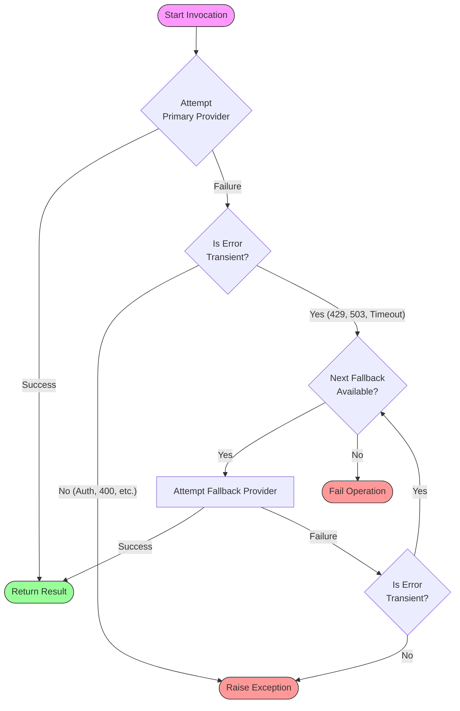

# Fallback Models Feature Documentation

## 1. Executive Summary

The **Fallback Models** feature enhances the operational resilience of `bmad-assist` by implementing an automated failover mechanism for Large Language Model (LLM) providers. When a primary provider encounters a transient failure (such as rate limiting, service timeouts, or temporary outages), the system automatically seamlessly switches to pre-configured alternative providers. This ensures the continuity of critical, long-running workflows without user intervention.

## 2. Architecture & Logic Flow

The fallback mechanism operates on a simple but robust failover chain handling specifically **transient errors**. Non-transient errors (like authentication failures or invalid requests) immediately halt execution to prevent cascading failures.

### Logic Schema



## 3. Configuration Reference

To enable fallbacks, define a `fallbacks` list within your provider configuration in `bmad-assist.yaml`. This feature is available for all provider scopes: `master`, `multi`, and `helper`.

### 3.1 Standard Configuration (Master/Single-LLM)

For phases using a single LLM (e.g., `create_story`), configure the master provider chain.

```yaml
providers:
  master:
    # Primary Provider: The preferred high-performance model
    provider: anthropic
    model: claude-3-5-sonnet-20241022
    settings_path: ~/.bmad/claude_settings.json

    # Fallback Chain: Tried sequentially upon transient failure
    fallbacks:
      # Tier 1 Fallback: A strong alternative
      - provider: google
        model: gemini-1.5-pro

      # Tier 2 Fallback: A highly available backup
      - provider: anthropic
        model: claude-3-haiku-20240307
```

### 3.2 Advanced Configuration (Multi-LLM)

For parallel execution phases like `code_review` or `validate_story`, each reviewer can possess an independent fallback chain. This isolation prevents one provider's outage from stalling the entire parallel operation.

```yaml
providers:
  multi:
    # Reviewer A: Independent Chain (Claude -> Gemini)
    - provider: anthropic
      model: claude-3-5-sonnet-20241022
      fallbacks:
        - provider: google
          model: gemini-2.0-flash-exp

    # Reviewer B: Independent Chain (GPT-4 -> GPT-4o-mini)
    - provider: openai
      model: gpt-4o
      fallbacks:
        - provider: openai
          model: gpt-4o-mini
```

## 4. Operational details

### 4.1 Error Classification

The system intelligently distinguishes between retryable and fatal errors:

- **Transient Errors (Trigger Fallback):**
  - **Rate Limits (HTTP 429):** "Too Many Requests"
  - **Service Unavailability (HTTP 503):** "Service Overloaded"
  - **Timeouts:** Network or execution timeouts
- **Fatal Errors (Propagate Immediately):**
  - **Authentication (HTTP 401/403):** Invalid API keys
  - **Bad Request (HTTP 400):** Invalid model parameters or malformed prompts
  - **Context Window Exceeded:** Prompt exceeds model capacity

### 4.2 Logging & Observability

The following log levels are used to track fallback events:

| Event             | Log Level | Message                                                   |
| :---------------- | :-------- | :-------------------------------------------------------- |
| Primary Attempt   | `INFO`    | `Invoking primary {provider} (model={model})`             |
| Transient Failure | `WARNING` | `Primary provider failed with transient error: {details}` |
| Fallback Attempt  | `INFO`    | `Invoking fallback {N}/{Total}: {provider}`               |
| Fallback Success  | `INFO`    | `Fallback provider {provider} succeeded`                  |
| Complete Failure  | `ERROR`   | `All providers failed. Last error: {details}`             |

## 5. Implementation Architecture

The feature is implemented using the **Decorator** and **Factory** design patterns:

1.  **`FallbackProvider` (Decorator)**: Wraps a primary `BaseProvider` instance. It intercepts the `invoke()` method to handle error catching and delegation to the fallback list.
2.  **`ConfiguredProvider` (Value Object)**: Encapsulates a provider instance with its specific runtime configuration (model, settings), ensuring fallbacks run with their intended parameters.
3.  **`create_provider` (Factory)**: Located in `core.provider_factory`, this function centralizes provider instantiation. It automatically assembles the `FallbackProvider` chain based on the YAML configuration, abstracting complexity from the consumer code.

This architecture acts as a transparent middleware layer, requiring zero changes to the business logic of individual phases.
